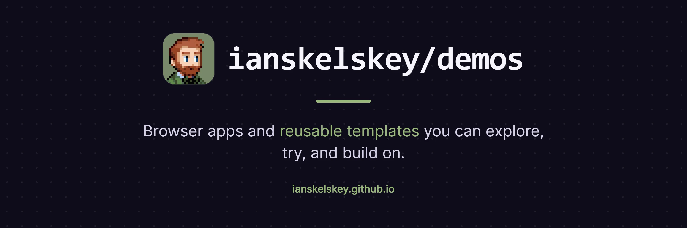

# ianskelskey.github.io

The demo hub at **[ianskelskey.github.io](https://ianskelskey.github.io/)** — one page that collects the small browser apps and reusable templates I publish on GitHub Pages, each with a link to try it, its source, and (for templates) a one-click "Use template".

For the bigger picture — work history, case studies, writing — see my portfolio at [ianskelskey.com](https://ianskelskey.com/).

## What's on it

| Project                                                             | Type        | What it is                                                                             |
| ------------------------------------------------------------------- | ----------- | -------------------------------------------------------------------------------------- |
| [Collab Code](https://ianskelskey.github.io/collab-code/)           | Application | Code together in the browser. Built for classrooms, tutoring, and pair programming.    |
| [game-feed](https://ianskelskey.github.io/my-game-feed/)            | Template    | Your gaming history, published as a website and JSON feed.                             |
| [react-ts-starter](https://ianskelskey.github.io/react-ts-starter/) | Template    | A React + TypeScript starting point with styling, accessibility, and deployment ready. |

The live list comes from [`src/data/projects.ts`](src/data/projects.ts); this table is a snapshot.

## Contributing

Built with React, TypeScript, Vite, and Tailwind CSS, starting from my [react-ts-starter](https://github.com/IanSkelskey/react-ts-starter) template. Adding a project, running the site locally, and deployment are covered in [CONTRIBUTING.md](CONTRIBUTING.md).

## License

[MIT](LICENSE)
